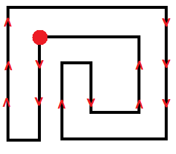

# Notes

## Day 10
- [Shoelace formula](https://en.wikipedia.org/wiki/Shoelace_formula) for calculating area inside a polygon.
  - Points need to be in the correct order. 
- Loops have direction (inside/outside points are always on either the left/right of the wall).  
    
